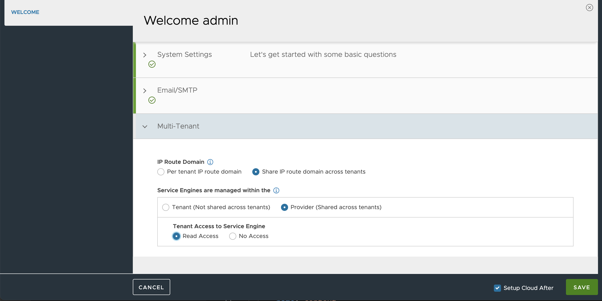
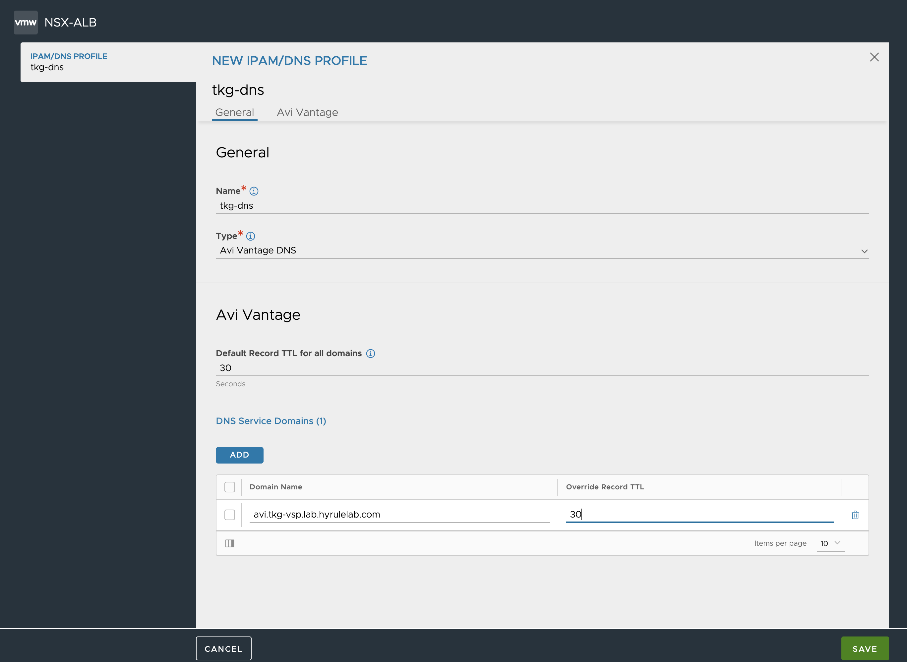

# NSX-ALB (AVI) Controller Setup

This guide includes a comprehensive set of steps to set up a NSX-ALB (AVI) Controller in a vSphere 6.7 or 7 environment to be used by TKG `v1.3.0+`

## 1. Get Binaries

To download the Controller binaries we can go to the same location where we download the rest of the TKG components [here](https://www.vmware.com/go/get-tkg).
Look for `VMware NSX Advanced Load Balancer`, `GO TO DOWNLOADS` and `DOWNLOAD NOW`.
That will take you to the Partner Connect Portal where you need to enter your credentials.
You will be redirected to the AVI Portal. Once there go to Downloads and download current version (20.1.4 when this guide was created). Choose the VMware Controller OVA.

## 2. Choose Topology

You can set up NSX-ALB to fit different network topologies, from a simple flat network to a scenario where management plane, data plane and nodes are in separate networks.
Here are some basic concepts related to NSX-ALB networking. For more information about basic NSX-ALB concepts and networking please check the official documentation.
- The Controller and Service Engine (SE) are connected to and communicate with each other via the Management network, for the controller to setup the SEs.
- The Service Engines are also connected to the Data network where the VIPs are allocated, to handle the LB traffic data.
- Kubernetes worker nodes where the pods, exposed via LB VIPs, need connectivity with the Data network for traffic to flow to the pods.

### 2.1. Flat Network
This is the simplest scenario with minimum requirements where the Management network, Data network, and Kubernetes nodes are on same network.

<br>

### 2.2. Separate Management network and VIP network
This is the minimum recommended for a Production environment to ensure separation between the LB Management Plane and Data Plane.

<br>

In the screenshots and configuration samples of this lab we will use this configuration. These are the networks used in the examples found below:

Management Network:
- VLAN: `TKG-VLAN14-PG`
- CIDR: `192.168.14.0/24`
- Controller IP: `192.168.14.190`
- SE Pool Range: `192.168.14.191 - 192.168.14.199`

Data Network:
- VLAN: `TKG-VLAN15-PG`
- CIDR: `192.168.15.0/24`
- VIP Pool Range: `192.168.15.10 - 192.168.15.99`

### 2.3. Separate Management network, VIP network and TKG network
This is the recommended approach for Production, with full separation.

<br>

## 3. Install Controller

Access vCenter and Deploy OVF Template selecting the Controller OVA you previously downloaded. Follow the instructions on screen to select Name and Folder/Location, Cluster or Resource Pool, Datastore and Network.

For the Network select the right Management Network according to the network topology chosen. Configure Management Network details: Controller IP, Subnet, Gateway. Leave key `Sysadmin login authentication key` empty.

<br>

## 4. Configure Controller

Power on the Controller VM you created in the previous step.
Wait a couple of minutes (~5m) and access the Controller IP in the Browser. Wait until the Controller setup wizard screen.

### 4.1 Initial Controller Setup

From the browser, follow the Controller Setup Wizard.

Choose the admin username and password. Email is optional.

<br>

Choose the right DNS resolver and Search Domain (optional) for your environment. Also choose a passphrase for the backups.

<br>

Choose the right NTP servers for your environment or leave the default ones if you have connectivity.

<br>

Choose None in the SMTP Setup

<br>

Choose Orchestrator
- Select VMware.

<br>

Provide vCenter Credentials
- Enter vSphere FQDN and credentials.
- Select Write permissions.
- Select `None` SDN Integration.

<br>

Choose Datacenter and IP Address management.
- Select Static IP Address management.
- Leave both checkboxes unchecked.

<br>


Configure Management Network

Sometimes this step is skipped during the installation wizard. If that is the case you can complete it after in the AVI Controller UI going to Infrastructure > Clouds > Default-Cloud > Edit > Network. And enter the information required ass per the instructions below.
- Select Management Network. Same network you chose when installing the AVI Controller OVA.
- You can choose `Static` or `DHCP`. In this lab we will chose `Static`, so the network range chosen should be outside of the DHCP range.
- In `IP Subnet` enter the Management Network CIDR. Same network used for the Controller IP.
- In `IP Address Pool` choose the available IP range within the CIDR. This range will be used to configure the Management Network NIC in the AVI Service Engines. Make sure this range does not overlap with the Controller IP. Also since we are selecting `Static` and since AVI Management Plane and TKG nodes will be in the same network then you need to make sure the DHCP range (needed by TKG) is limited to a specific part of this network to leave room for this `IP Address Pool`.
- Enter the Management Network Gateway.

<br>

Tenant Settings
- Choose Multiple Tenants? Select `No`

<br>


### 4.2. Configure DNS Profile
Already in the AVI UI, Go to `Templates > Profiles > IPAM/DNS Profiles`. Create `DNS Profile`:
- Choose a distinctive name.
- Select `Avi Vantage DNS` type.
- `Add DNS Service Domain` and enter a `Domain Name`. This will be the base subdomain to be used internally by AVI for the LB Services and Ingress. This is more critical for DNS and L7 capabilities (Enterprise License only) but better select a subdomain that can be managed.


- Click `Save`.

### 4.3. Configure IPAM Profile
Already at `Templates > Profiles > IPAM/DNS Profiles`. Create `IPAM Profile`:
- Choose a distinctive name.
- Select `Avi Vantage IPAM` type.
- Leave `Allocate IP in VRF` unchecked.
- Click `Add Usable Network` then select `Default-Cloud` option for cloud for usable network. And choose the network to be used for the VIPs. This is the Data Plane Network from your network topology.


- Click `Save`.

### 4.4. Add Profiles to Cloud
Go to `Infrastructure > Cloud` and Edit the `Default-Cloud` by clicking on the pencil icon on the right side.

In the `Infrastructure` tab of the pop-up screen scroll down and select `IPAM` and `DNS` Profiles we just created.

Click `Save`.


### 4.5. Create VIP Pool
Go to `Infrastructure > Networks` and Edit the network you chose in the `IPAM Profile` configuration.

Click on `Add subnet`:
- Enter the CIDR of the Data Network to be used for the VIPs in the `IP Subnet` field.
- Click on `Add Static IP Address Pool` and add the range to be used for VIPs in that subnet. Make sure `Use Static IP Address for VIPs and SE` is checked.

- Click `Save` twice.

You should see now both Management and Data networks ready with the respective ranges you have configured:

<br>


### 4.6. Create Custom Certificate for Controller

The default certificate configured in the Controller doesn't contain IP SAN and because of that the AKO Operator will fail to communicate with the Controller. To fix this we need to generate and configure a new certificate.

Go to `Templates > Security > SSL/TLS Certificates` and create a `Controller Certificate`.
In the pop-up form, insert the following information:
- Choose a distinctive name.
- You can leave type = `Self Signed` unless you are using an existing CSR or importing the certificate.
- Choose a distinctive Common Name. This can be the same as name since we are adding the IP or hostname as a SAN.
- `Subject Alternate Name (SAN)` should be Controller IP or hostname
<br>
- Click `Save`.

Go to `Administration > Settings > Access Settings` and edit `System Access Settings` by clicking on the pencil icon on the right side:
- Delete all certificates in the `SSL/TLS Certificate` field, add the custom certificate you created above:
<br>
- Click `Save`.
- Reload the page since the Controller cert has changed.

Go to `Templates > Security > SSL/TLS Certificates` and export the certificate you created y clicking on the export icon on the right side:

<br>

Base64 encode the certificate so that the lab can correctly prepare the TKG Management Cluster configuration file. Assuming you have exported the certificate in a file named `avi_ca_new`, run the following command:
```
base64 avi_ca_new
```
You will use the output value in the `avi.avi-ca-data` property in your `params.yaml` file.


> TODO : Create trusted CA cert instead of self-signed.


## License
> TODO
