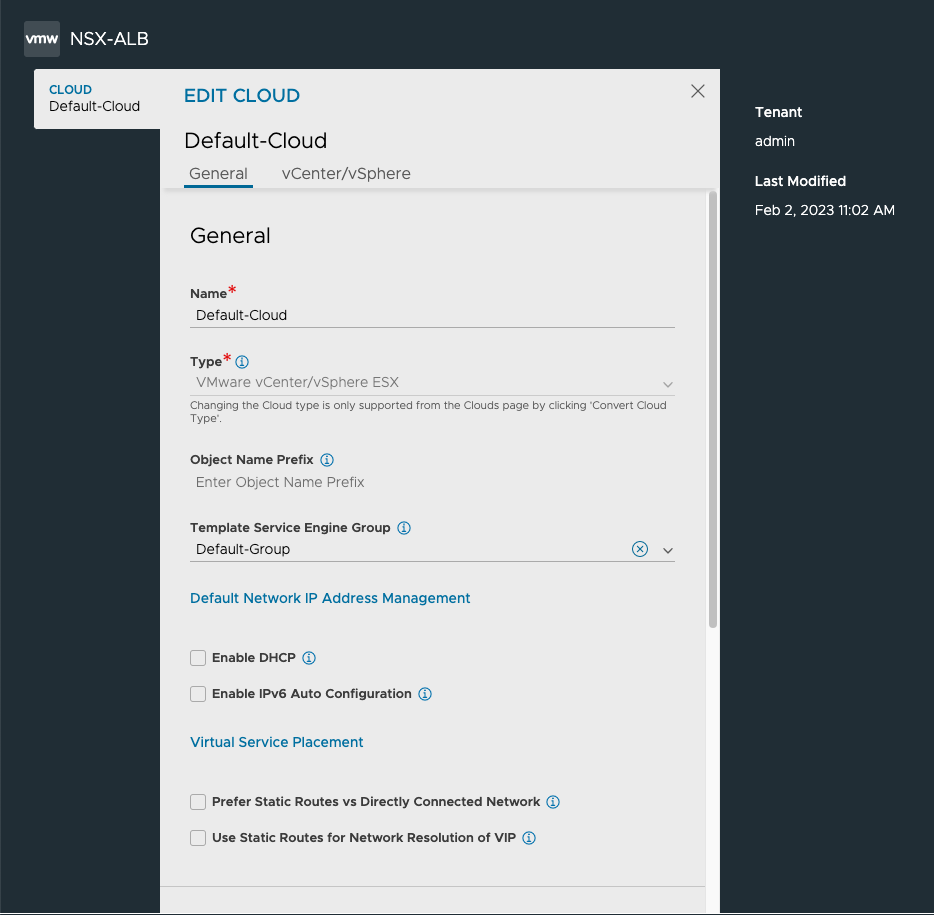
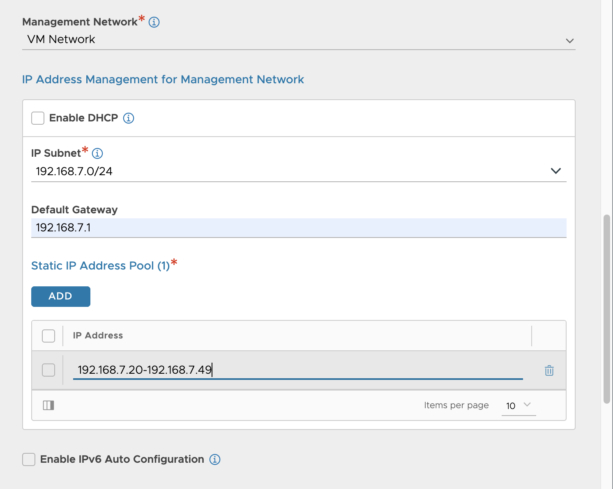
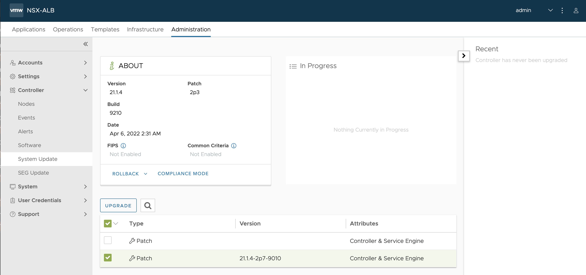
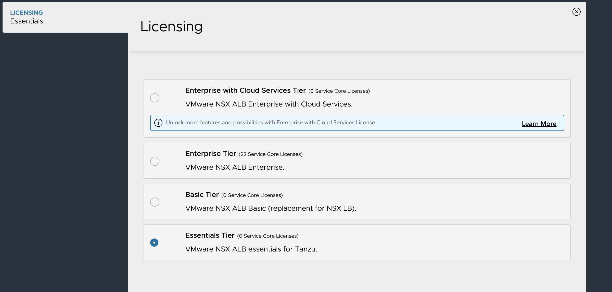
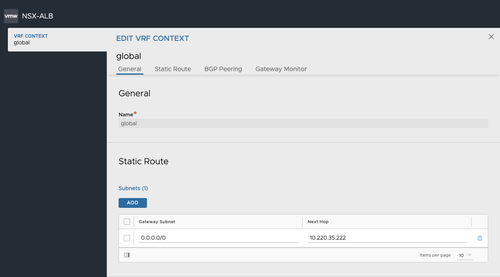
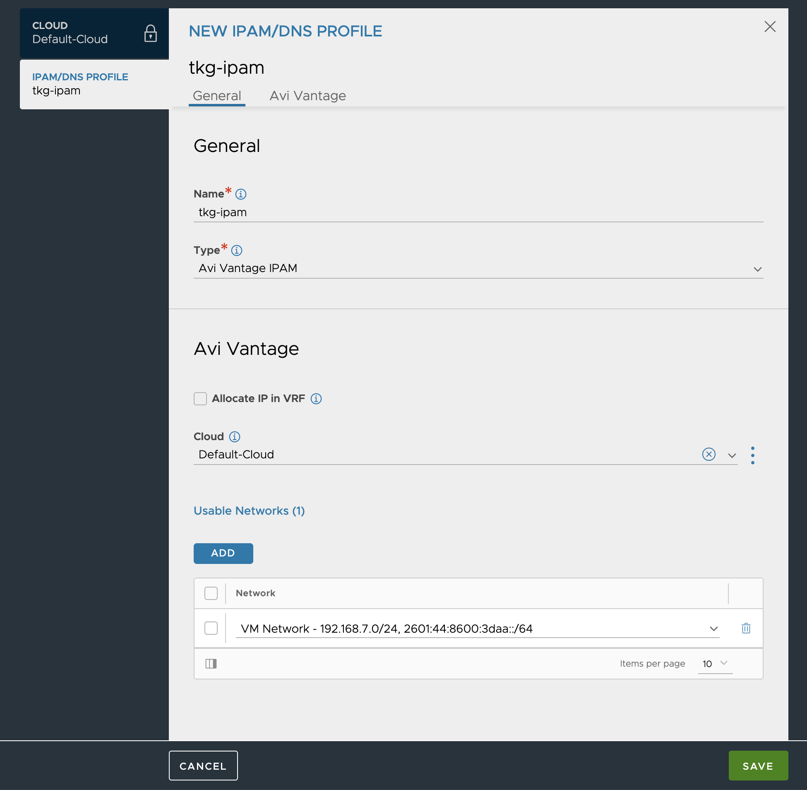
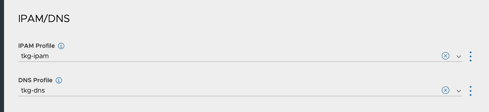
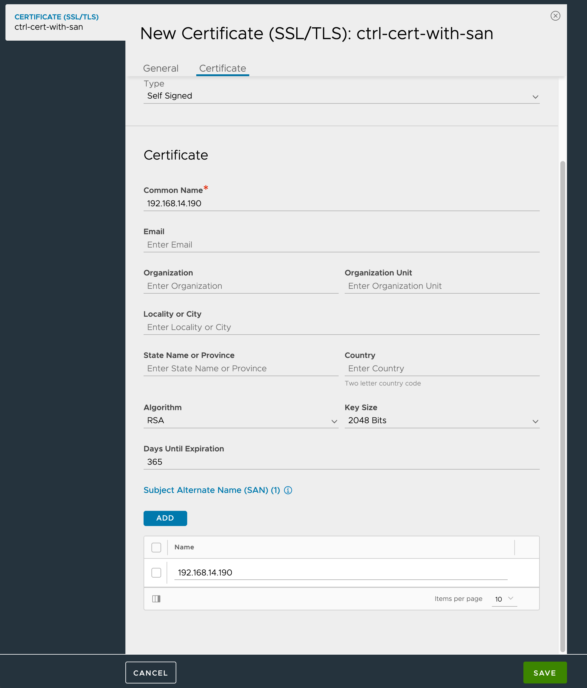

# NSX-ALB (AVI) Controller Setup

This guide includes a comprehensive set of steps to set up a NSX-ALB (AVI) Controller in a vSphere 6.7 or 7 environment to be used by TKG `v1.5.0+`

## 1. Get Binaries

To download the Controller binaries we can go to the same location where we download the rest of the TKG components [here](https://www.vmware.com/go/get-tkg).
Look for `VMware NSX Advanced Load Balancer`, `GO TO DOWNLOADS` and `DOWNLOAD NOW`.
That will take you to the Partner Connect Portal.  If don't already have an active session, you will need to log-in.
You will be redirected to the AVI Portal. Once there go to Downloads and download current version (`20.1.7` when this guide was updated last). Choose the VMware Controller OVA.

## 2. Choose Topology

You can set up NSX-ALB to fit different network topologies, from a simple flat network to a scenario where management plane, data plane and nodes are in separate networks.
Here are some basic concepts related to NSX-ALB networking. For more information about basic NSX-ALB concepts and networking please check the official documentation.
- The Controller and Service Engine (SE) are connected to and communicate with each other via the Management network, for the controller to setup the SEs.
- The Service Engines are also connected to the Data network where the VIPs are allocated, to handle the LB traffic data.
- Kubernetes worker nodes where the pods, exposed via LB VIPs, need connectivity with the Data network for traffic to flow to the pods.

### 2.1. Flat Network
This is the simplest scenario with minimum requirements where the Management network, Data network, and Kubernetes nodes are on same network.

<br>

In the screenshots below, it is assumed you are using the `Seperate Management network and VIP network` configuration.  However, if you choose the `Flat Network` configuration, we will point out any optional or different steps.  Here are the configuration parameters in one of our contributor's (guess who) homelab.

All-in-one Management and Data Network:
- VLAN: `VM Network`
- CIDR: `192.168.7.0/24`
- Controller IP: `192.168.7.11`
- DHCP Range (for TKG Nodes): `192.168.7.70 - 192.168.7.149`
- SE & VIP Pool Range: `192.168.7.21 - 192.168.7.50`

### 2.2. Separate Management network and VIP network
This is the minimum recommended for a Production environment to ensure separation between the LB Management Plane and Data Plane.

<br>

In the screenshots and configuration samples of this lab we will use this configuration. These are the networks used in the examples found below:

Management Network:
- VLAN: `TKG-VLAN14-PG`
- CIDR: `192.168.14.0/24`
- Controller IP: `192.168.14.190`
- DHCP Range (for TKG Nodes): `192.168.14.6 - 192.168.14.179`
- SE Pool Range: `192.168.14.191 - 192.168.14.199`

Data Network:
- VLAN: `VIP-VLAN15-PG`
- CIDR: `192.168.15.0/24`
- VIP Pool Range: `192.168.15.10 - 192.168.15.99`

### 2.3. Separate Management network, VIP network and TKG network
This is the recommended approach for Production, with full separation.

<br>

## 3. Install Controller

### 3.1 Deploy OVA
Access vCenter and Deploy OVF Template selecting the Controller OVA you previously downloaded. Follow the instructions on screen to select Name and Folder/Location, Cluster or Resource Pool, Datastore and Network.

For the Network select the right Management Network according to the network topology chosen. Configure Management Network details: Controller IP, Subnet, Gateway. Leave key `Sysadmin login authentication key` empty.

<br>

### 3.2 Resize VM
By default the AVI Controller VM is configured with 8 CPUs and 24 GB of RAM. We have confirmed that the needs of this lab require less resources and so this VM can be re-sized to the minimum allocation of CPU & Memory according to the documentation [here](https://avinetworks.com/docs/20.1/avi-controller-sizing/): 4 CPUs and 12 GB RAM.

To make these changes, EDIT the Hardware settings of the VM before powering it on, change the CPUs from 8 to 4 and the Memory from 24 to 12.

<br>


## 4. Configure Controller
Power on the Controller VM you created in the previous step.
Wait a couple of minutes (~5m) and access the Controller IP in the Browser. Wait until the Controller setup wizard screen.

### 4.1 Initial Controller Setup
From the browser, follow the Controller Setup Wizard.

Choose the admin username and password. Email is optional.

<br>

Choose the right DNS resolver.  Choose Search Domain (optional, if you do not use FQDN references for internal components) for your environment. Also choose a passphrase for the backups.

<br>

Choose None in the SMTP Setup

<br>

In the Multi-Tenant screen leave all the defaults:

<br>

Check the `Select Cloud After` checkbox at the bottom-right of the screen. Click `Save`.


### 4.2 Orchestrator setup
If you did not check the checkbox in the previous screen go to `Infrastructure > Clouds`. Then edit the `Default-Cloud`:

Choose Orchestrator
- Select VMware.

<br>

Provide vCenter Credentials
- Enter vSphere FQDN and credentials.
- Select Write permissions.

<br>

Choose Datacenter. You can leave all checkboxes unchecked for Static IP Address management and default settings.

<br>


Configure Management Network
- Select Management Network. Same network you chose when installing the AVI Controller OVA.
- Select `Default-Group` for `Template Service Engine Group`.
- You can choose `Static` or `DHCP`. In this lab we will chose `Static`, so the network range chosen should be outside of the DHCP range.
- In `IP Subnet` enter the Management Network CIDR. Same network used for the Controller IP.
- In `Add IP Static Address Pool` choose an available IP range within the CIDR. This range will be used to configure the Management Network NIC in the AVI Service Engines. Make sure this range does not overlap with the Controller IP. Also since we are selecting `Static` and since AVI Management Plane and TKG nodes will be in the same network then you need to make sure the DHCP range (needed by TKG) is limited to a specific part of this network to leave room for this `IP Address Pool`.
- Enter the Management Network `Default Gateway`.

<br>

Click `Save`.

### 4.3 Set Scope for Service Engines to Specific vSphere Clusters

The NSX ALB Controller will create service engines on vSphere clusters for which it has permissions.  In the event you are using an administrative vSphere user account with multiple clustesr, that means these service engines could be created anywhere and perhaps different SEs in a single SE Group will be created in different clusters.  

You can set the scope for a given SE Group to constrain the SE creation to specific clusters or hosts.  This may particularly be useful if a single vSphere cluster is designated to support Tanzu.

Go to `Infrastructure > Service Engine Group`. Then edit the `Default-Cloud`:

Choose `Advanced` tab of the resulting dialog.

In the `Host & Data Store Scope` section, select your desired vSphere cluster.

<br>

Click `Save`.


### 4.4 Upgrade Controller to latest patch (Optional)
To get the latest UI based capabilities is best to upgrade to the latest patch of the release you are using: (`20.1.7-2p8` when this guide was updated last).

Go to `Administration > Controller > Software`. Click on `Upload from Computer` and select the avi-patch `pkg` file.

<br>

Go to `Administration > Controller > System Update`. Click on the checkbox next to the patch you just uploaded and click on the `Upgrade` button.

<br>

On the pop-up window, leave settings as they are and click `Continue`. Wait for the upgrade to finish. The UI will eventually become inresponsive and you will have to log-in again.

### 4.5 Switch to Essentials Tier (Optional)
Go to `Administration > Settings > Licensing`. Click on the crank wheel next to the `Licensing` title. Select `Essentials License`. Click `Save`. Click `Continue`.

<br>

In Essentials Tier we don't have `auto-gateway` so we need to create a Default Gateway route to ensure traffic can flow from SEs to pods and back to the clients. Go to `Infrastructure > Routing` and create a `Static Route`, with:
- Gateway Subnet: `0.0.0.0/0`
- Next Hop: The Gateway of the VIP Network you are going to use

<br>


### 4.6. Configure DNS Profile (Optional, only relevant for NSX ALB Enterprise)
Go to `Templates > Profiles > IPAM/DNS Profiles`. Create `DNS Profile`:
- Choose a distinctive name.
- Select `Avi Vantage DNS` type.
- `Add DNS Service Domain` and enter a `Domain Name`. This will be the base subdomain to be used internally by AVI for the LB Services and Ingress. This is more critical for DNS and L7 capabilities (Enterprise License only) but better select a subdomain that can be managed.


- Click `Save`.

### 4.7. Configure IPAM Profile
Go to `Templates > Profiles > IPAM/DNS Profiles`. Create `IPAM Profile`:
- Choose a distinctive name.
- Select `Avi Vantage IPAM` type.
- Leave `Allocate IP in VRF` unchecked.
- Click `Add Usable Network` then select `Default-Cloud` option for cloud for usable network. And choose the network to be used for the VIPs. This is the Data Plane Network from your network topology.


- Click `Save`.

### 4.8. Add Profiles to Cloud
Go to `Infrastructure > Clouds` and Edit the `Default-Cloud` by clicking on the pencil icon on the right side.

In the `Infrastructure` tab of the pop-up screen scroll down and select `IPAM` and `DNS` (if NSX ALB Enterprise) Profiles we just created.

Click `Save`.


### 4.9. Create VIP Pool (Only for 2 network configuration, skip for flat network)
Go to `Infrastructure > Networks` and Edit the network you chose in the `IPAM Profile` configuration.

Click on `Add subnet`:
- Enter the CIDR of the Data Network to be used for the VIPs in the `IP Subnet` field.
- Click on `Add Static IP Address Pool` and add the range to be used for VIPs in that subnet. Make sure `Use Static IP Address for VIPs and SE` is checked.

- Click `Save` twice.

You should see now both Management and Data networks ready with the respective ranges you have configured:

<br>


### 4.10. Create Custom Certificate for Controller

The default certificate configured in the Controller doesn't contain IP SAN and because of that the AKO Operator will fail to communicate with the Controller. To fix this we need to generate and configure a new certificate.

Go to `Templates > Security > SSL/TLS Certificates` and create a `Controller Certificate`.
In the pop-up form, insert the following information:
- Choose a distinctive name.
- You can leave type = `Self Signed` unless you are using an existing CSR or importing the certificate.
- Choose a distinctive Common Name. This can be the Controller IP or hostname.
- `Subject Alternate Name (SAN)` should be Controller IP or hostname
<br>
- Click `Save`.

Go to `Administration > Settings > Access Settings` and edit `System Access Settings` by clicking on the pencil icon on the right side:
- Delete all certificates in the `SSL/TLS Certificate` field, add the custom certificate you created above:
<br>
- Click `Save`.
- Reload the page since the Controller cert has changed.

Go to `Templates > Security > SSL/TLS Certificates` and export the certificate you created by clicking on the export icon on the right side:

<br>

Click the `Copy to clipboard` button for the key and save it to `keys/nsx-alb-controller.key`.

Click the `Copy to clipboard` button for the cert and save it to `keys/nsx-alb-controller.cert`.

Base64 encode the certificate so that the lab can correctly prepare the TKG Management Cluster configuration file.

On Mac:
```bash
export NSX_ALB_CONTROLLER_ENCODED_CERT=`cat keys/nsx-alb-controller.cert | base64`
yq e -i '.avi.avi-ca-data = env(NSX_ALB_CONTROLLER_ENCODED_CERT)' $PARAMS_YAML
```

On Linux:
```bash
export NSX_ALB_CONTROLLER_ENCODED_CERT=`cat keys/nsx-alb-controller.cert | base64 -w 0`
yq e -i '.avi.avi-ca-data = env(NSX_ALB_CONTROLLER_ENCODED_CERT)' $PARAMS_YAML
```

### 4.11. Extend UI Session Timeout (Optional)

The NSX ALB Controller UI has a 15 minute session timeout.  This may be too quick for efficent activity for POCs.  You can extend the UI session timeout as a user preference.

Click the `AVI` icon in the top right corner of the NSX ALB Controller UI and choose `My Account`.

Set your desired session timeout in the `Controller Settings` section of the `Edit My Account` dialog.

<br>
