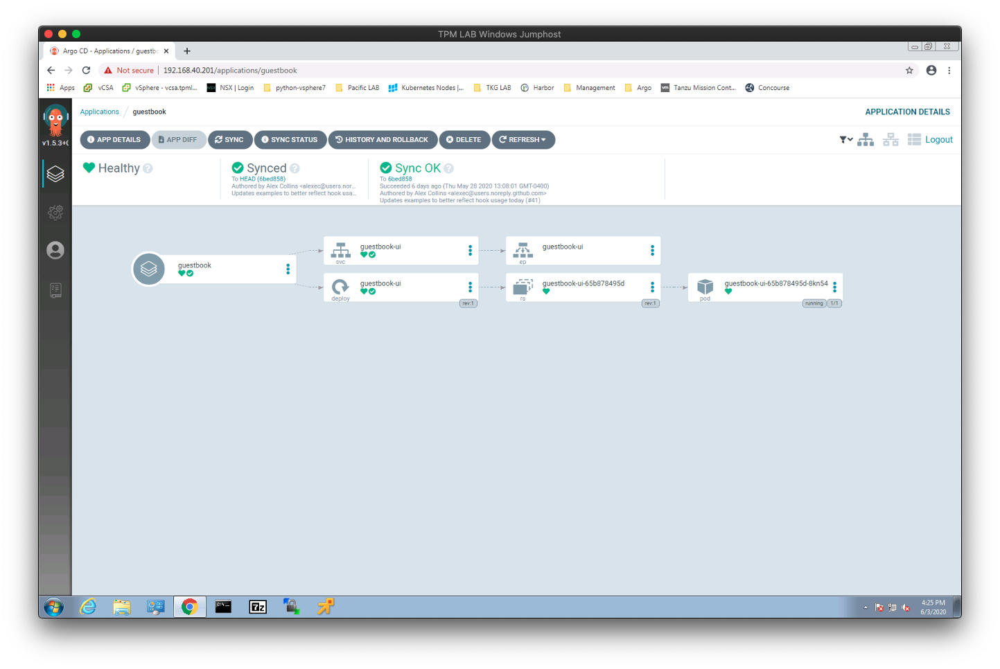
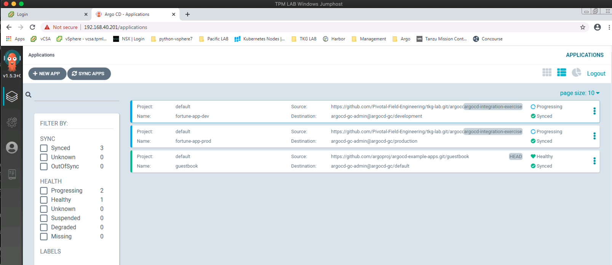
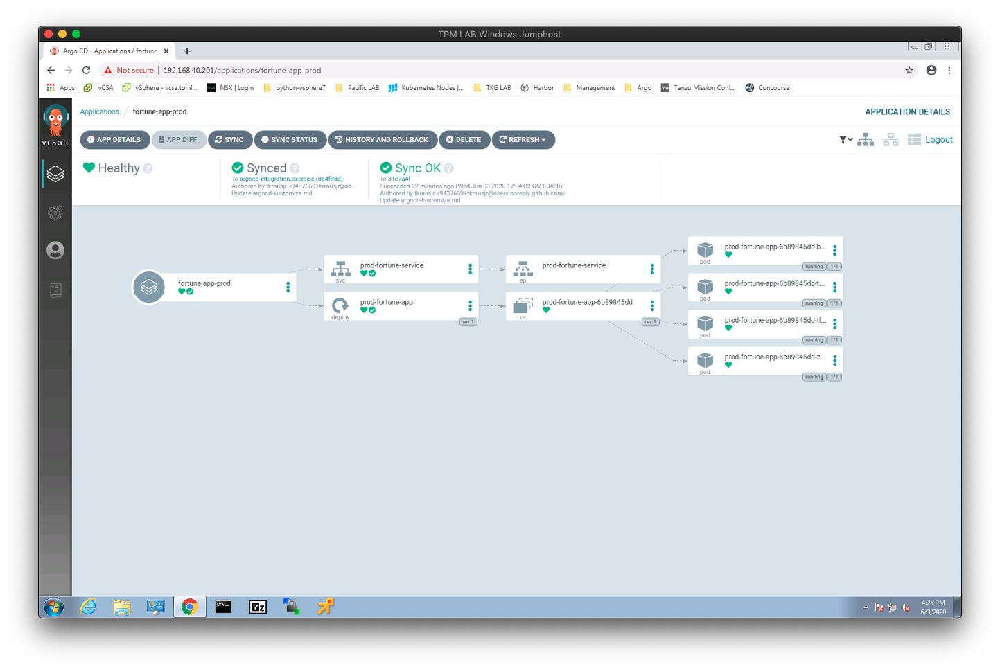

# ArgoCD and Kustomize

In this lab, we will install ArgoCD in the Shared Services Cluster

Also (optionally) we will use ArgoCD to deploy and synchronize two different configurations for the same Application using  Kustomize overlays. ArgoCD will deploy and continuously reconcile our intended state of the applicaiton as represented by the Kustomize configuration and Kubernetes manifests stored in our Github repo with the Kubernetes API Server.

## Set configuration parameters

The scripts to prepare the YAML to deploy argocd depend on a parameters to be set.  Ensure the following are set in `params.yaml`:

```yaml
argocd:
  server-fqdn: argocd.dorn.tkg-aws-e2-lab.winterfell.live
  password: REDACTED
```

## Prepare Manifests and Install ArgoCD

ArgoCD installation will be based on the following: https://argoproj.github.io/argo-cd/getting_started/. Manifests will be output into `generated/$CLUSTER_NAME/argocd/` in case you want to inspect.

```bash
./scripts/generate-and-apply-argocd-yaml.sh
```

## Validation Step

1. All ArgoCD pods are in a running state:
```bash
kubectl get po -n argocd -o wide
```

2. Access the ArgoCD UI
```bash
open https://$(yq e .argocd.server-fqdn $PARAMS_YAML)
```

## Install ArgoCD CLI

On a Linux or MAC Machine with network access to Kubernetes clusters,  download the latest ArgoCD CLI from https://github.com/argoproj/argo-cd/releases/latest.

```bash
# For linux, follow below.  For Max, customize where appropriate.  Also, check version.
$ wget https://github.com/argoproj/argo-cd/releases/download/v1.6.1/argocd-linux-amd64 .
$ chmod +x argocd-linux-amd64
$ mv argocd-linux-amd64 /usr/local/bin/argocd
$ argocd --help
```

## Register Workload Cluster in ArgoCD Controller

This script will add your workload Kubernetes cluster to the ArgoCD Controller. First we will create a service account in the workload cluster for argocd.  Then setup a kubeconfig context for that account. It assumes that you have successfully installed the ArgoCD CLI following the section above these lines.

```bash
./scripts/register-cluster-argocd.sh
```

## Test ArgoCD Installation

Deploy ArgoCD guestbook example application

```bash
$ kubectl create ns guestbook
$ argocd app create guestbook \
  --repo https://github.com/argoproj/argocd-example-apps.git \
  --path guestbook \
  --dest-server `kubectl config view -o jsonpath="{.clusters[?(@.name=='$(yq e .workload-cluster.name $PARAMS_YAML)')].cluster.server}"` \
  --dest-namespace guestbook \
  --sync-policy automated

application 'guestbook' created

$ argocd app list

  NAME       CLUSTER                      NAMESPACE  PROJECT  STATUS  HEALTH   SYNCPOLICY  CONDITIONS  REPO                                                 PATH       TARGET
  guestbook  https://192.168.40.107:6443  default    default  Synced  Healthy  <none>      <none>      https://github.com/argoproj/argocd-example-apps.git  guestbook
```
Change ArgoCD guestbook example application Service type to LoadBalancer


```bash
$ kubectl patch svc guestbook-ui -p '{"spec": {"type": "LoadBalancer"}}'
service/guestbook-ui patched
```

Test access to the ArgoCD Web UI

```bash
$ echo $(yq r $PARAMS_YAML argocd.server-fqdn)
```

1. In Chrome, navigate to the UI on address above
2. Login with
    1. admin and the password you set earlier.
3. Click on the guestbook app you created from the argocd CLI and investigate it.


## Demonstrate Continuous Deployment

In this example we will use ArgoCD CLI to deploy two different configurations for the same Application using the Kustomize overlays.

Create two different namespaces for the two different configurations of our application. this could easily be two different clusters as well.

```bash
$ kubectl create ns fortune-app-production
$ kubectl create ns fortune-app-development
```

Deploy the Development version of the fortune Application. This version shares the base configuration from the argocd/base folder but overrides the following configuration values:
- 2 replicas in the deployment
- Service Type of ClusterIP instead of LoadBalancer as we will be running E2E tests against the application via another Pod deployed in the same cluster so we don’t need to waste a VIP and Service type LoadBalancer.  
- Deployed to the “fortune-app-development" Namespace in our Kubernetes cluster.

```bash
$ argocd app create fortune-app-dev \
  --repo https://github.com/Pivotal-Field-Engineering/tkg-lab.git \
  --path argocd/fortune-teller/dev \
  --dest-server `kubectl config view -o jsonpath="{.clusters[?(@.name=='$(yq e .workload-cluster.name $PARAMS_YAML)')].cluster.server}"` \
  --dest-namespace fortune-app-development \
  --sync-policy automated

application 'fortune-app-dev' created
```
Deploy the Production version of the fortune Application. This version shares the base configuration from the argocd/base folder but overrides the following configuration values:
- 4 replicas in the deployment
- Service Type of LoadBalancer to expose the application outside the Kubernetes cluster.
- Deployed to the “fortune-app-production" Namespace in our Kubernetes cluster.
```bash
$ argocd app create fortune-app-prod \
  --repo https://github.com/Pivotal-Field-Engineering/tkg-lab.git \
  --path argocd/fortune-teller/production \
  --dest-server `kubectl config view -o jsonpath="{.clusters[?(@.name=='$(yq e .workload-cluster.name $PARAMS_YAML)')].cluster.server}"` \
  --dest-namespace fortune-app-production \
  --sync-policy automated

application 'fortune-app-prod' created
```
List the applications to see the current status using the ArgoCD Cli.

```bash
$ argocd app list                                       

NAME              CLUSTER                      NAMESPACE    PROJECT  STATUS  HEALTH       SYNCPOLICY  CONDITIONS  REPO                                                      PATH               TARGET
fortune-app-dev   https://192.168.40.107:6443  development  default  Synced  Progressing  Auto        <none>      https://github.com/Pivotal-Field-Engineering/tkg-lab.git  argocd/dev         argocd-integration-exercise
fortune-app-prod  https://192.168.40.107:6443  production   default  Synced  Progressing  Auto        <none>      https://github.com/Pivotal-Field-Engineering/tkg-lab.git  argocd/production  argocd-integration-exercise
guestbook         https://192.168.40.107:6443  default      default  Synced  Healthy      Auto        <none>      https://github.com/argoproj/argocd-example-apps.git       guestbook
```

Look at the ArgoCD applications in the ArgoCD UI.


Get details on the ArgoCD Production fortune-app application in the ArgoCD UI.

