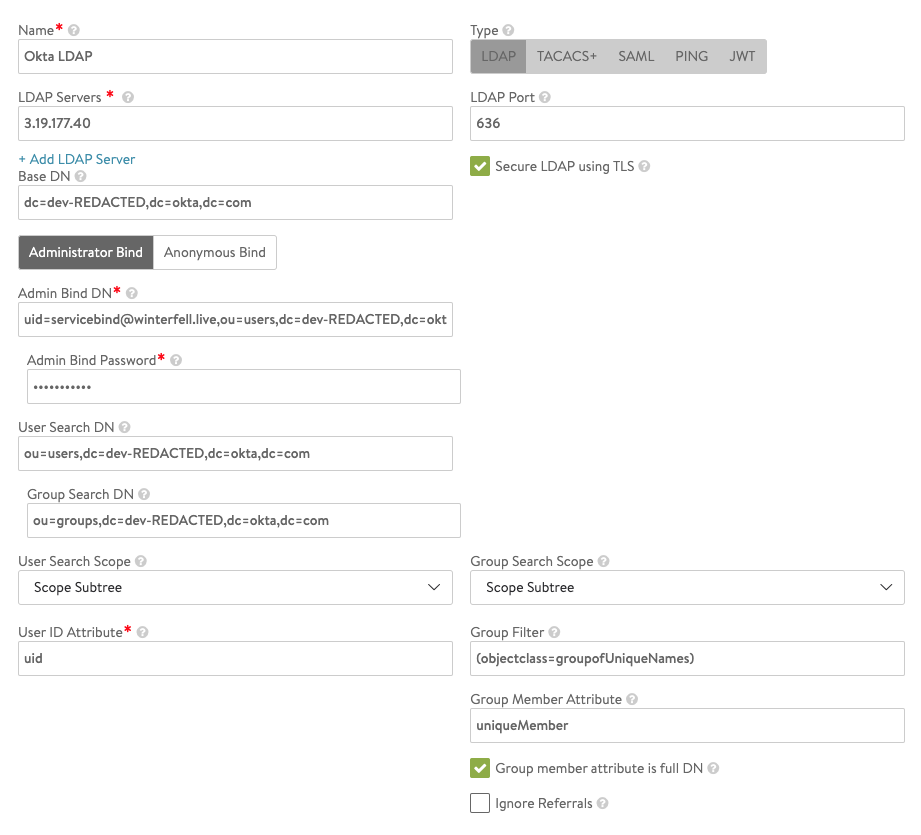
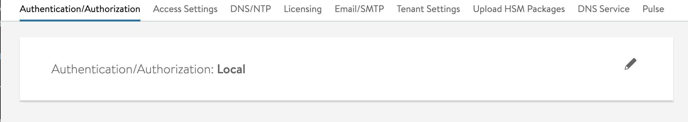
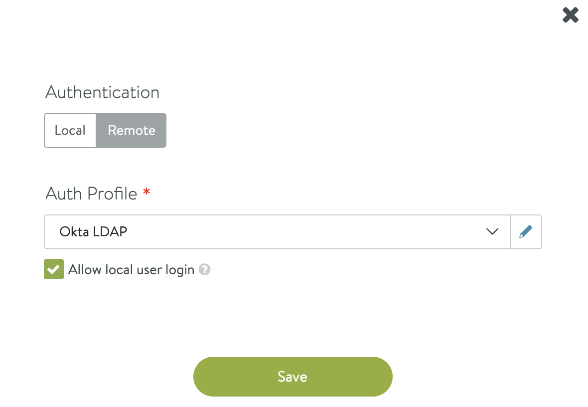
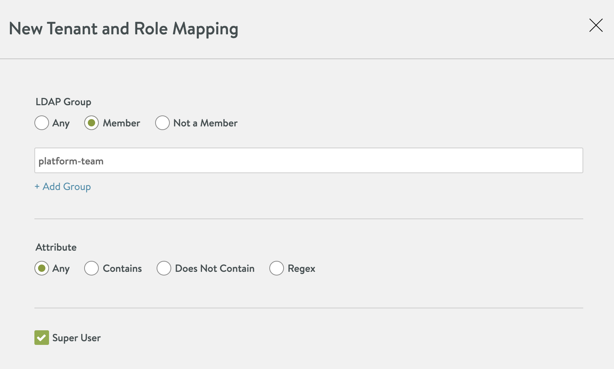

# Configure NSX ALB Auth with Okta LDAP

The standard [NSX ALB Lab](../avi/setup_avi_ctrl.md) leverages as single local NSX ALB admin account.  However, the TKG labs leverage Okta for enterprise authentication (via OIDC).

NSX ALB has the ability to configure authentication policies to integrate with enterprise IdPs.  However, it does not support OIDC.  Good news is that Okta provides for an LDAP interface to the same member repository that you setup for the TKG labs.

In this bonus lab, we will configure the LDAP Interface for Okta and then configure NSX ALB so that members of the `platform-team` group can perform administrative functions on NSX ALB.

## Configure Okta for LDAP Integration

- Create Sevice Bind User
- Enbale LDAP Permissions
- Test Access

### 1. Create Sevice Bind User

A bind user is an account that is used for the client (NSX ALB) to initially access the LDAP interface for queries.

Access Okta using your account owner account.

Choose Directory (side menu) > People > Add Person:
- Set First Name, Last Name and Email: (e.g: service bind, servicebind@winterfell.live)
- Password Set by Admin, YOUR_PASSWORD
- Uncheck user must change password on first login

Now set this new user as a Read Only Administrator for your account.

Choose Security (side menu) > Administrators > Add Administrator:
- In Grant administrator role to: enter your servicebind user account
- Assign the `Read Only Administrator` role

### 2. Enbale LDAP Permissions

Access Okta using your account owner account.  Then following the [Enable the LDAP interface](https://help.okta.com/en/prod/Content/Topics/Directory/LDAP-interface-enable.htm) docs.  Note down the important settings provided.

| Settings | Value |
| ------ | ----- |
| Host | dev-REDACTED.ldap.okta.com |
| Port and Protocol | Port 636 - SSL (recommended), Port 389 - StartTLS |
| Base DN | dc=dev-REDACTED,dc=okta,dc=com |
| User Base DN | ou=users,dc=dev-REDACTED,dc=okta,dc=com |
| Group Base DN | ou=groups, dc=dev-REDACTED, dc=okta, dc=com |

[LDAP Inteface Connection Settings](https://help.okta.com/en/prod/Content/Topics/Directory/LDAP-interface-connection-settings.htm) docs page provides additional valuable connection settings usefule for interacting with this interface.

### 3. Test Access

```bash
# Get all users
ldapsearch -H ldaps://dev-REDACTED.ldap.okta.com:636 -x -D "uid=servicebind@winterfell.live,ou=users,dc=dev-REDACTED,dc=okta,dc=com" -b "ou=users,dc=dev-REDACTED,dc=okta,dc=com" -W

# Get all groups
ldapsearch -H ldaps://dev-REDACTED.ldap.okta.com:636 -x -D "uid=servicebind@winterfell.live,ou=users,dc=dev-REDACTED,dc=okta,dc=com" -b "ou=groups,dc=dev-REDACTED,dc=okta,dc=com" -W
```

## Configure NSX ALB for LDAP Authentication

- Create Auth Policy
- Assign Auth Policy
- Create Role Mapping for Admin Permissions
- Test it Out

### 1. Create Auth Policy

As of NSX ALB v20.1.6, ESSENTIALS tier licensing can not use UI to create policies and this action must be performed using the shell.

#### Enterprise Licensing Instructions

Go to `Templates -> Security -> Auth Profile`.

Choose `Create` button at top left of profile table.

In the New Auth Profile dialog, complete the form and click save.



>Note: Ensure you use an IP Address for the LDAP Server.  Since I had not setup DNS services within NSX ALB, I could not get the host name to resolve.  I got the IP Address by doing a `nslookup` command on my provided hostname.

#### Essentials Licensing Instructions

SSH into the NSX ALB Contoller and configure the auth policy.  Below is a redacted transcript of the command.

```
ssh admin@NSX_ALB_IP
shell

# within shell
> configure authprofile "Okta LDAP"
authprofile> type AUTH_PROFILE_LDAP
authprofile> ldap
authprofile:ldap> server 3.19.177.40
authprofile:ldap> port 636
authprofile:ldap> security_mode AUTH_LDAP_SECURE_USE_LDAPS
authprofile:ldap> base_dn dc=dev-REDACTED,dc=okta,dc=com
authprofile:ldap> bind_as_administrator
authprofile:ldap> settings
authprofile:ldap:settings> admin_bind_dn uid=servicebind@winterfell.live,ou=users,dc=dev-REDACTED,dc=okta,dc=com
authprofile:ldap:settings> password REDACTED
authprofile:ldap:settings> user_search_dn ou=users,dc=dev-REDACTED,dc=okta,dc=com
authprofile:ldap:settings> user_search_scope AUTH_LDAP_SCOPE_SUBTREE
authprofile:ldap:settings> user_id_attribute uid
authprofile:ldap:settings> group_search_dn ou=groups,dc=dev-REDACTED,dc=okta,dc=com
authprofile:ldap:settings> group_member_attribute uniqueMember
authprofile:ldap:settings> group_search_scope AUTH_LDAP_SCOPE_SUBTREE
authprofile:ldap:settings> group_member_is_full_dn
authprofile:ldap:settings> group_filter (objectclass=groupofUniqueNames)
authprofile:ldap:settings> no ignore_referrals
saveauthprofile:ldap:settings> 
authprofile:ldap> save
authprofile> save
+-----------------------------+-------------------------------------------------------------------------+
| Field                       | Value                                                                   |
+-----------------------------+-------------------------------------------------------------------------+
| uuid                        | authprofile-20b8fdb9-f82e-4821-859c-af251034c902                        |
| name                        | Okta LDAP                                                               |
| type                        | AUTH_PROFILE_LDAP                                                       |
| ldap                        |                                                                         |
|   server[1]                 | 3.19.177.40                                                             |
|   port                      | 636                                                                     |
|   security_mode             | AUTH_LDAP_SECURE_USE_LDAPS                                              |
|   base_dn                   | dc=dev-REDACTED,dc=okta,dc=com                                          |
|   bind_as_administrator     | True                                                                    |
|   settings                  |                                                                         |
|     admin_bind_dn           | uid=servicebind@winterfell.live,ou=users,dc=dev-REDACTED,dc=okta,dc=com |
|     password                | <sensitive>                                                             |
|     user_search_dn          | ou=users,dc=dev-REDACTED,dc=okta,dc=com                                 |
|     user_search_scope       | AUTH_LDAP_SCOPE_SUBTREE                                                 |
|     user_id_attribute       | uid                                                                     |
|     group_search_dn         | ou=groups,dc=dev-REDACTED,dc=okta,dc=com                                |
|     group_member_attribute  | uniqueMember                                                            |
|     group_search_scope      | AUTH_LDAP_SCOPE_SUBTREE                                                 |
|     group_member_is_full_dn | True                                                                    |
|     group_filter            | (object=class=groupofUniqueNames)                                       |
|     ignore_referrals        | True                                                                    |
|   email_attribute           | email                                                                   |
|   full_name_attribute       | name                                                                    |
| tenant_ref                  | admin                                                                   |
+-----------------------------+-------------------------------------------------------------------------+
```

### 2. Assign Auth Policy

Now that the policy is created, we must configure the controller to use it.

Go to `Administration -> Settings -> Authentication/Authorization`.



Click the pencil icon to edit the configuration.

Choose `Remote` Authenticaiton and select your newly created Auth Profile.



### 3. Create Role Mapping for Admin Permissions

Now map the `platform-team` group to super user access.

Click `New Mapping` button.



Map the members of the `platform-team` to Super User and click `Save`.

### 4. Test it out

Log out of NSX ALB controller.  Top right choose `AVI` icon and choose `Sign Out`.

Now log in as a member of your Okta `platform-team`.
