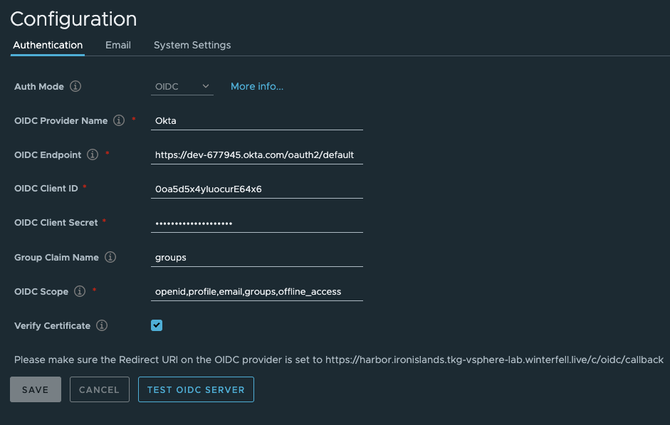

# Install Harbor Image Registry

### Set environment variables
The following section should be added to or exist in your local params.yaml file:

```bash
harbor:
  harbor-cn: harbor.<shared-cluster domain name>
  notary-cn: notary.<shared-cluster domain name>
```

### Change to Shared Services Cluster
Harbor Registry should be installed in the shared services cluster, as it is going to be available to all users.  We need to ensure we are in the correct context before proceeding.

```bash
CLUSTER_NAME=$(yq r $PARAMS_YAML shared-services-cluster.name)
kubectl config use-context $CLUSTER_NAME-admin@$CLUSTER_NAME
```

### Prepare Manifests
Prepare the YAML manifests for the related Harbor K8S objects.  Manifest will be output into `harbor/generated/` in case you want to inspect.
```bash
./harbor/00-generate_yaml.sh $(yq r $PARAMS_YAML shared-services-cluster.name)
```

### Create Harbor namespace and certs
Create the Harbor namespace and certificate.  Wait for the certificate to be ready.
```bash
kubectl apply -f generated/$CLUSTER_NAME/harbor/01-namespace.yaml
kubectl apply -f generated/$CLUSTER_NAME/harbor/02-certs.yaml  
watch kubectl get certificate -n harbor
```

### Add helm repo and install harbor
```bash
helm repo add harbor https://helm.goharbor.io
helm upgrade --install harbor harbor/harbor -f generated/$CLUSTER_NAME/harbor/harbor-values.yaml --namespace harbor
```

## Validation Step
1. All harbor pods are in a running state:
```bash
kubectl get po -n harbor
```
2. Certificate is True and Ingress created:
```bash
kubectl get cert,ing -n harbor
```
3. Open a browser and navigate to https://<$HARBOR_CN>.  The default user is admin and pwd is Harbor12345
```bash
open https://$(yq r $PARAMS_YAML harbor.harbor-cn)
```

## Add Integration with Okta

### Add an additional application to your Okta Account

1. Log into your Okta account you created as part of the [Okta Setup Lab](../mgmt-cluster/04_okta_mgmt.md).  The URL should be in your `params.yaml` file under okta.auth-server-fqdn.

2. Choose Applications (top menu) > Add Application > Create New App > Web, Click Next.

3. Complete the form as follows, and then click Done.
  - Give your app a name: `Harbor`
  - Remove Base URL
  - Login redirect URIs: `https://<harbor.harbor-cn from $PARAMS_YAML>/c/oidc/callback` #
  - Logout redirect URIs: `https://<harbor.harbor-cn from $PARAMS_YAML>/c/oidc/logout`
  - Grant type allowed: `Authorization Code`

3. Capture `Client ID` and `Client Secret` for use later

4. On the top left, Choose the arrow next to Developer Console and choose `Classic UI`

5. Choose Applications (top menu) > Applications > Pick your app > Sign On tab > Edit **OpenID Connect ID Token** section
  - Groups claim type => `Filter`
  - Groups claim filter => **groups** Matches regex **.\***

### Configure Harbor for OIDC Authentication



1. Log-in to Harbor as admin and password Harbor12345

2. On the right hand nav, select Administration -> Configuration

3. Choose Authentication tab, and then complete the form as follows:
  - Auth Mode: `OIDC`
  - OIDC Provider Name: `Okta`
  - OIDC Endpoint: `https://<okta.auth-server-fqdn from $PARAMS_YAML>/oauth2/default`
  - OIDC Client ID: Value copied from Okta console
  - OIDC Client Secret: Value copied from Okta console
  - Group Claim Name: `groups`
  - OIDC Scope: `openid,profile,email,groups,offline_access`
  - Verify Certificate: `checked`

4. Click `Test OIDC Server`, then click `Save`

### Login to Harbor UI via OIDC

1. Logout of Harbor

2. In an incognito window, access Harbor UI: https://<harbor.harbor-cn from $PARAMS_YAML>.  You will now see a `Login Via OIDC Provider` button on the login page.

```bash
open https://$(yq r $PARAMS_YAML harbor.harbor-cn)
```

3. Click `Login Via OIDC Provider` button, you will be redirected to Okta login page.

4. Login as `alana`, you will be redirected back to Harbor.  But this time it will ask you to provide a local harbor username to associate with your Okta profile.

5. You are now logged in with standard user privileges.

### Login to Harbor via docker cli

1. On top right of the page, click on your name, and select `User Profile`.  The resulting window contains your `CLI secret`.  This is the secret you must use to login to harbor using the docker cli.

2. Now login with docker cli.  Use your Okta username and your `CLI secret` from Harbor

```bash
docker login https://$(yq r $PARAMS_YAML harbor.harbor-cn) -u alana
```

### Add Alana as Admin

1. Now logout of Harbor UI.  Log back in as `admin` and password `Harbor12345`

2. On the right hand nav, select Administration -> Users

3. Select `alana` user and click the `Set as Admin` button

4. Next time `alana` logs in, she will have admin privileges.


