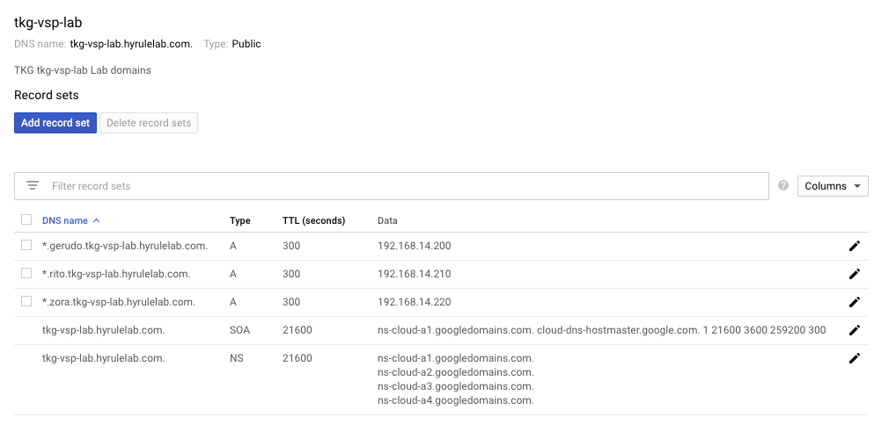

# Google Cloud DNS instructions

This is a set of instructions to help users of these labs to use Google Cloud DNS instead of Route53 as DNS provider. Be aware that these steps are more manual than the rest of the labs and will require some changes in the scripts and yaml.

When to use theses instructions:
- Follow steps 1 and 2 below only ones and before doing any of the Contour labs.
- Then complete step 3 below at the beginning of **every** Contour lab, and before the Contour lab steps.
- Finally complete steps 4 and 5 during **every** Contour lab following the instructions below which replace specific parts of that lab.

## 1. Create GCP Service account

We need to create a service a GCP DNS zone. Follow these [instructions](https://certbot-dns-google.readthedocs.io/en/stable/) to create it. Then store the service account json file in the `keys` folder with a descriptive name: in these instructions we'll use `certbot-gcp-service-account.json`.


## 2. Create GCP DNS zone and delegate to it from your DNS registrar

> NOTE: This manual step replaces the step where you run `./scripts/create-hosted-zone.sh` which only to be executed when using Route53.

In your GCP web console go to Network Services > [Cloud DNS](https://console.cloud.google.com/net-services/dns/zones/). Create a new zone with `DNS Name` equal to your `subdomain` in your `params.yaml` file.

One the zone is created, retrieve the NS records from it. You will need to configure your DNS provider where your TLD is registered to delegate to those NS for the `subdomain` in question.

## 3. Create secret with GCP Service Account json

**This steps must be completed on each k8s cluster**, since we will need this secret every time we leverage Cert Manager and Let's Encrypt to create a new certificate. Run this command with the right json filename:
```
kubectl create secret generic certbot-gcp-service-account \
        --from-file=keys/certbot-gcp-service-account.json \
        -n cert-manager
```

## 4. Add DNS records in your GCP DNS zone

> NOTE: You will execute this step on **every** Contour lab.

While in the Contour lab, when you reach the step to run the `scripts/generate-and-apply-external-dns-yaml.sh` script, don't run it and instead create the DNS record in Cloud DNS manually.

Create an A record with the value of the `ingress-fqdn` from the cluster you are configuring at this moment as specified in your `params.yaml` configuration file. The A record should point to the LoadBalancer IP or hostname of your Envoy service. 

To make sure you have the right one run this command and check the `ip` or `hostname` value returned:
```
kubectl get svc envoy -n tanzu-system-ingress -o jsonpath='{.status.loadBalancer.ingress[0]}'
```

Check this screenshot for reference:



## 5. Edit and apply ClusterIssuer with a Cloud DNS dns01 challenge

> NOTE: You will execute this step on **every** Contour lab.

While in the Contour lab, when you reach the step to run the `generate-and-apply-cluster-issuer-yaml.sh` script, do the following after you run it:
- Edit the `generated/$CLUSTER_NAME/contour/contour-cluster-issuer.yaml` file where `$CLUSTER_NAME` is the `name` of the cluster you are configuring.
- Replace the entire block under `dns01` solver block with this one:
```
cloudDNS:
  # The ID of the GCP project
  project: $PROJECT_NAME
  # This is the secret used to access the service account
  serviceAccountSecretRef:
    name: certbot-gcp-service-account
    key: certbot-gcp-service-account.json
```
- Replace `$PROJECT_NAME` with the name of your GCP project, and make sure that the `serviceAccountSecretRef` properties are aligned with the GCP Service Account Secret you created earlier.
- Re-apply the ClusterIssuer yaml running the following command replacing `$CLUSTER_NAME` with the the `name` of the cluster you are configuring:
```
kubectl apply -f generated/$CLUSTER_NAME/contour/contour-cluster-issuer.yaml
```

Alternatively you could edit the script before running it and change the ClusterIssuer yaml before it's applied the first time.
