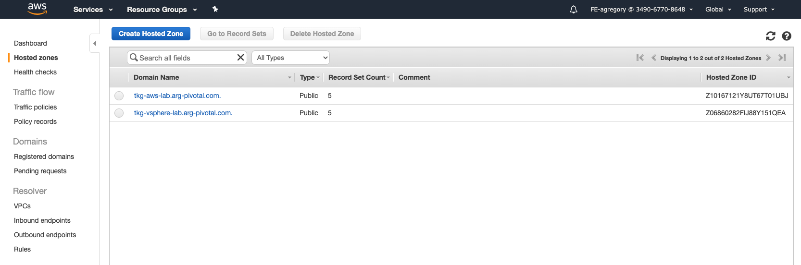
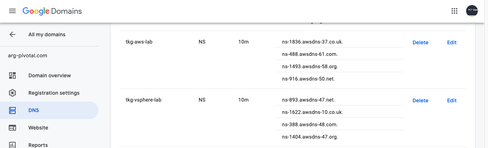
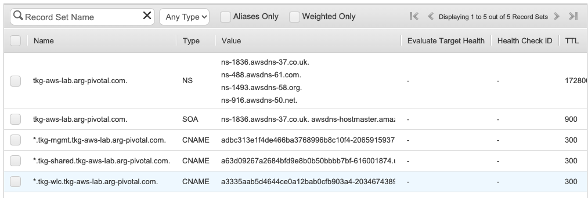
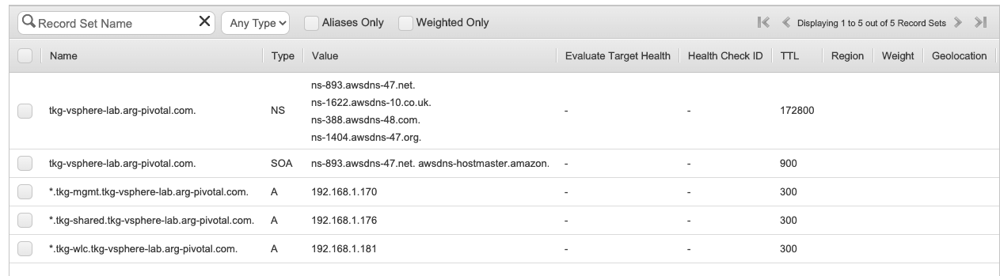

# DNS Setup

In order for the labs to work, you need to have an appropriate domain and DNS set up.  What this boils down to is a global domain that you own/control, with delegation of a subdomain for the lab work.  Many users will already have it set up for other purposes.  An example of this would look like:
* example.com (owned domain name)
  * tkg-aws-lab.example.com (NS Record -> Route53 Hosted Zone #1)
  * tkg-vsphere-lab.example.com (NS Record -> Route53 Hosted Zone #2)
* tkg-aws-lab.example.com (Managed by Route53 as a Public Hosted Zone)
  * \*.tkg-mgmt.tkg-aws-lab.example.com (Route53 Record Set - CNAME -> AWS LB)
  * \*.tkg-shared.tkg-aws-lab.example.com (Route53 Record Set - CNAME -> AWS LB)
  * etc...
* tkg-vsphere-lab.example.com (Managed by Route53 as a Public Hosted Zone)
  * \*.tkg-mgmt.tkg-vsphere-lab.example.com (Route53 Record Set - A Record -> Metal LB IP)
  * \*.tkg-shared.tkg-vsphere-lab.example.com (Route53 Record Set - A Record -> Metal LB IP)
  * etc...
* homelab.example.com (NS Record -> Google Cloud DNS)     # Not in scope for lab - for example only
  * opsman.homelab.example.com (Managed by GCloud DNS zone A Record -> 192.168.x.x)   # Not in scope for lab - for example only
  * etc...

## Screen Shots

This is what it looks liek to have 2 Hosted Zones in AWS Route53.  Each zone will independently manage all DNS entries within that subdomain.  The lab scripts will create entires as needed.  Note that when created, the Zone ID can be obtained from here and pasted into the params file.



Here is what the initial top-level domain delegation would look like.  This is from Google Domains, but the same strategy will work for other providers, such as GoDaddy.  The trick is to create a Hosted Zone first (where you want to manage all entries for the lab) and then paste the NS entries created into your domain management's DNS area.  This dlegates all lookups to the new Hosted Zone.



Once this linkage is set up, you can add entries to each hosted zone manually or via script.  The lab will update Route53 automatically, using you AWS Access/Secret key and the Hosted Zone ID that you set into the params file.  Once the labs are completed, this is what the Hosted Zone will look like.  There are 2 examples here, one for AWS and one for vSphere.  This is because of the way K8s LoadBalancers are managed.  On AWS, an EC2 Load Balancer is created for each cluster's API endpoint -and- for each Service type LoadBalancer created in the cluster.  On vSphere, we are using NSX ALB.

### Hosted Zone for AWS-deployed Lab
  
### Hosted Zone for vSphere-deployed Lab
  

## About the Ingress Controller

As part of configuring your params.yaml file, note that we ask do define several FQDNs in advance - these do not need to be manually created in the Hosted Zone as Record Sets, nor are they specifically created by scripts.  Rather, we use a wildcard (seen above), such that any name that falls within that wildcard will be resolved.  In a Kubernetes cluster that utilizes an Ingress Controller (which the lab does - Contour), all traffic goes there and then is directed to the correct service/pods via Ingress Rules. These will be created as necessary.


A resulting nslookup call will show the IP that was created for the LoadBalancer and populated into the Hosted Zone by the script:

```bash
# Within Shared Cluster
andrew@ubuntu-jump:~/tkg/tkg-lab$ k get svc envoy -n tanzu-system-ingress
NAME    TYPE           CLUSTER-IP      EXTERNAL-IP     PORT(S)                      AGE
envoy   LoadBalancer   100.65.251.92   192.168.1.176   80:30256/TCP,443:30425/TCP   7d18h

# NSLOOKUP for anything in shared cluster:
andrew@ubuntu-jump:~/tkg/tkg-lab$ nslookup logs.tkg-shared.tkg-vsphere-lab.arg-pivotal.com
Server:		8.8.8.8
Address:	8.8.8.8#53

Non-authoritative answer:
Name:	logs.tkg-shared.tkg-vsphere-lab.arg-pivotal.com
Address: 192.168.1.176

```
