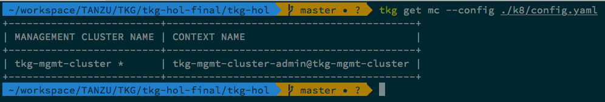

# TKG Management Cluster Setup

#### Note:
Make sure you have params.yaml file already updated with all required parameters.

## Option 1 - Consolidated Script

If you want to create `Management Cluster`, install `External DNS`, `Contour` and `Dex` then execute below script otherwise go to option 2.

### For AWS
```bash
./management-cluster-setup/02-create-mgmt-cluster/aws/scripts/build_mgmt.sh
```

### For vSphere
```bash
./management-cluster-setup/02-create-mgmt-cluster/vsphere/scripts/build_mgmt.sh
```

## Option 2 - Individual Scripts

### Bootstrap Env and Create Management Cluster

Execute the below commands one after the other to create management cluster

#### For AWS
```bash
./management-cluster-setup/02-create-mgmt-cluster/aws/scripts/00-bootstrap-aws.sh
./management-cluster-setup/02-create-mgmt-cluster/aws/scripts/01-create-mgmt-cluster.sh
```

#### For vSphere
```bash
./management-cluster-setup/02-create-mgmt-cluster/vsphere/scripts/00-bootstrap-vsphere.sh
./management-cluster-setup/02-create-mgmt-cluster/vsphere/scripts/01-create-mgmt-cluster.sh
```

Once the above command is completed, it will update the `./k8/config.yaml` file with the updated parameters which can be used to connect to the Management Cluster.

###### Validate the TKG management-cluster installation
```bash
tkg get management-clusters --config ./k8/config.yaml
```




Continue to Next Step: [Configure External DNS](02_install_external_dns.md)
