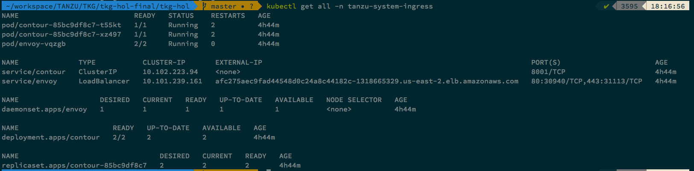

### Deploy Contour
Below script is going to deploy contour and also create an A record in route53 for the envoy service.
```bash
./management-cluster-setup/02-create-mgmt-cluster/scripts/02-install-contour.sh
```

###### Validate Contour Installation
```bash
kubectl get all -n tanzu-system-ingress
```


This will also add a `CNAME` entry in AWS Hosted zone which you created earlier. The `CNAME` will be mapped to AWS load balancer.

Example: Example: *.mgmt.tkg.lab.your-domain

Continue to Next Step: [Configure Dex](03_install_dex.md)
