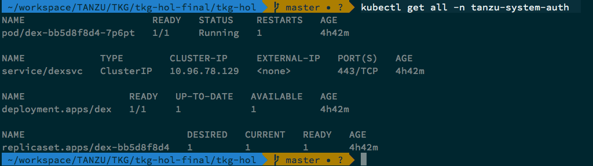
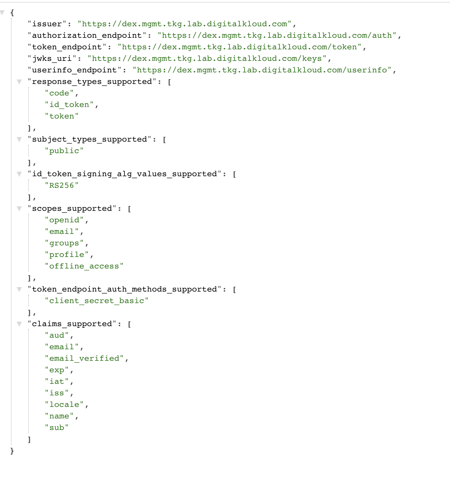

### Deploy Dex
Below script installs dex on management cluster. Make sure to update params.yaml file according to your env.

## AWS
```bash
./management-cluster-setup/02-create-mgmt-cluster/aws/scripts/03-install-dex.sh
```

## vSphere
```bash
./management-cluster-setup/02-create-mgmt-cluster/vsphere/scripts/04-install-dex.sh
```

###### Validate Dex installation
```bash
kubectl get all -n tanzu-system-auth
```


###### Validate from the UI:
You should see a JSON response as a result. Get the value in your params.yml for dex.host

https://[dex.host]/.well-known/openid-configuration



Back To [Home](../../README.md)
