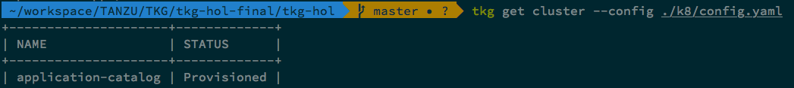

# Create TKG Shared Service Cluster Setup

#### Note:
Make sure you have params.yaml file already updated with all required parameters.

## Option 1 - Consolidated Script

If you want to create `service cluster`, deploy `contour`, `gangway`, `elasticsearch-kibana` and `fluent-bit` then execute below script otherwise go to option 2.

```bash
./shared-services-cluster-setup/scripts/build_svc.sh
```

## Option 2 - Individual Scripts

### Create Shared Services Cluster

```bash
./shared-services-cluster-setup/scripts/01-create-workload-cluster.sh
```

###### Validate the TKG management-cluster installation
```bash
tkg get cluster --config ./k8/config.yaml
```




Continue to Next Step: [Configure TMC](01a-configure-tmc.md)
