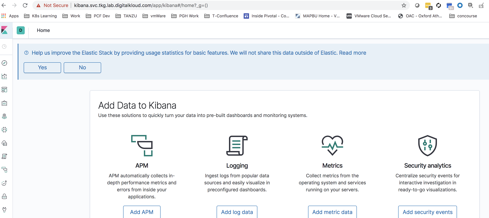

# Install elasticsearch and kibana

Run the below command which will install Elastic Seach and Kibana

```bash
./shared-services-cluster-setup/scripts/06-install-elasticsearch-kibana.sh
```

To Validate, browse to the Kibana url which is provided in the `params.yml`.

It should be something similar to: kibana.svc.tkg.lab.your-domain





Continue to Next Step: [Configure FluentBit](07-install-fluent-bit.md)
