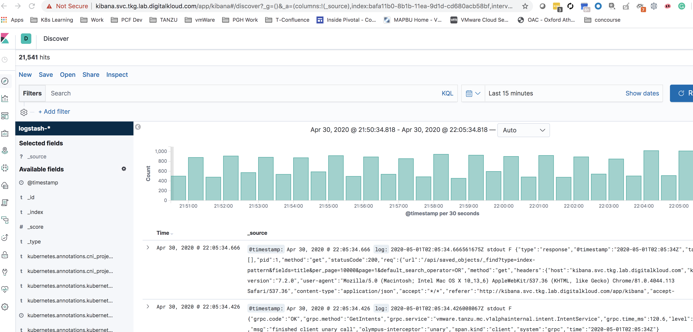

# Install Fluent-bit

Run the below command to install fluent bit. Once installed it will start sending logs to ELK Stack.

```bash
./shared-services-cluster-setup/scripts/07-install-fluent-bit.sh
```

Once installed, go back to your kibana dashboard and configure with "logstash-*". You will see your cluster logs flowing throw.




Continue to Next Step: [Configure Velero](08-install-velero.md)
