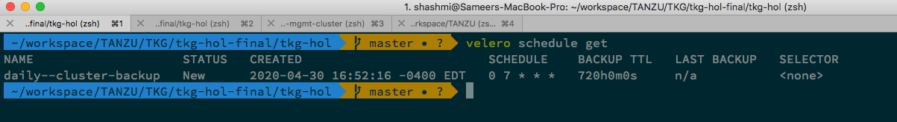

# Install Velero and Schedule Backups

##### Make sure you have params.yaml file already updated with all required parameters.

This requires a bucket name where all the backups will be stored. The below script will create the bucket in S3 and then install velero.

Run this below command to install and create a schedule of the backup.

```bash
./k8/scripts/velero/build.sh
```

Once execiuted, run the below command to verify the schedule

```bash
velero schedule get
```




Back To [Home](../README.md)
