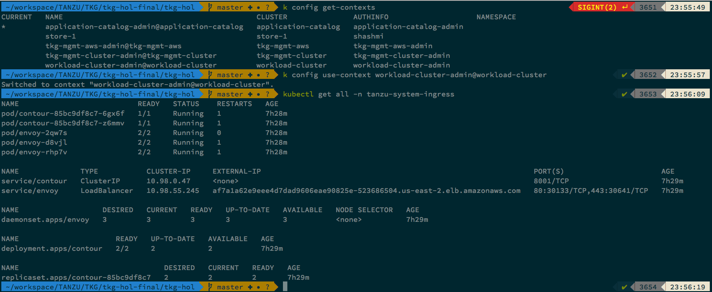

# Configure Ingress Controller

###### Below script is going to deploy contour. External DNS is going to create a wild card A record for envoy service.

## AWS

```bash
./workload-cluster-setup/aws/scripts/03-install-contour.sh
```

## vSphere

```bash
./workload-cluster-setup/vsphere/scripts/04-install-contour.sh
```

###### Validate Contour Installation
```bash
kubectl get all -n tanzu-system-ingress
```


This will also add a `CNAME` entry in AWS Hosted zone which you created earlier. The `CNAME` will be mapped to AWS load balancer.

Example: *.app.tkg.lab.your-domain


Continue to Next Step: [Configure Gangway](04_install_gangway.md)
