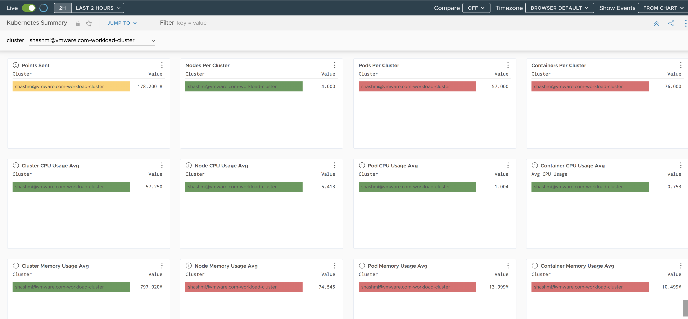

# Deploy WaveFront

Run the below command which will install the Wavefront Helm chart and configure it the the wavefront api token you provided.

```bash
./workload-cluster-setup/scripts/05-install-wavefront.sh
```

## Access wavefront

https://surf.wavefront.com and filter the cluster list to your $VMWARE_ID-service-cluster-name.




Continue to Next Step: [Configure FluentBit](06-install-fluent-bit.md)
