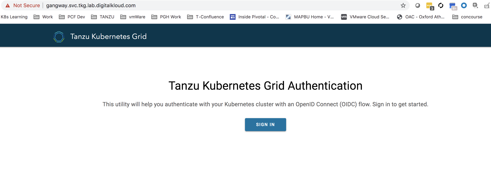
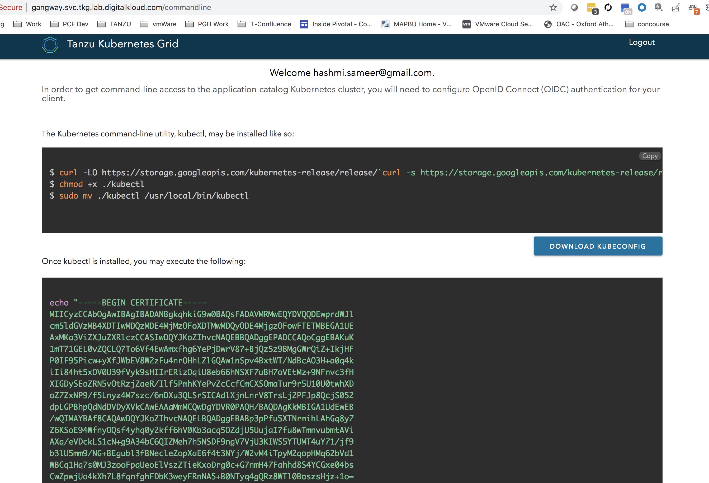
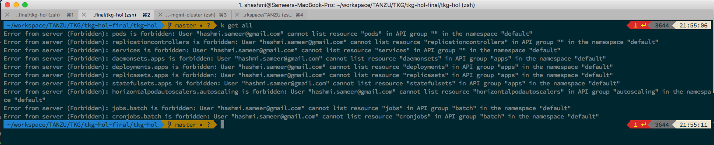
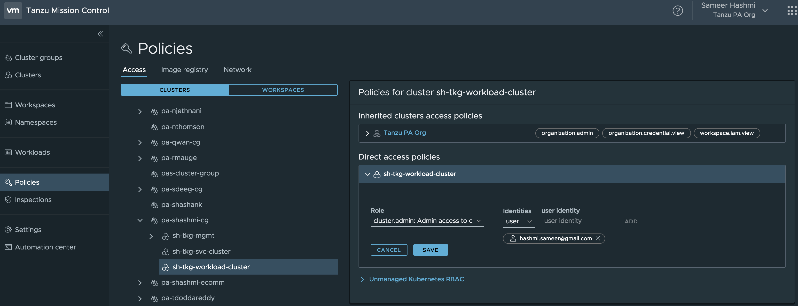
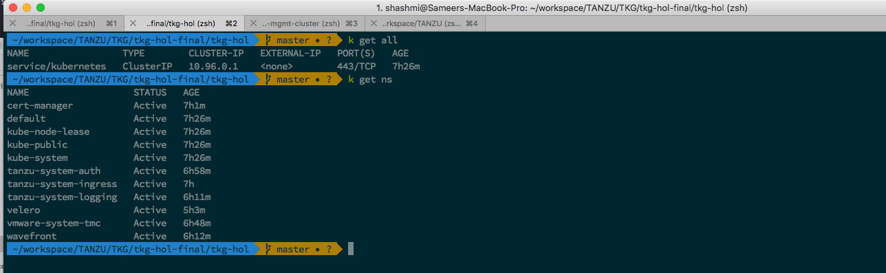

# Install & Validate Gangway

** These are the same steps executed in the Shared Services Cluster**

Steps to Install and Validate Dex & Gangway workflow:

- Install Gangway through the below command

## AWS

  ```bash
  ./workload-cluster-setup/aws/scripts/04-install-gangway.sh
  ```

## vSphere

  ```bash
  ./workload-cluster-setup/vsphere/scripts/05-install-gangway.sh
  ```

- Validate all the objects have been initialized

  ```bash
  kubectl get all -n tanzu-system-auth
  ```

- Download the kubeconfig for the OKTA user which was created in the prerequisites step.

  From the `params.yml` file, get the gangway url for shared service cluster.
  It should be something similar to `gangway.svc.tkg.lab.yourdomain`. Navigate to the URL.

  

  Sign in using the same account which you used to setup OKTA initially. As soon as you sign in, you will land to the page where you can download the `KUBECONFIG` for this user.

  

  Download the `KUBECONFIG` and place it to the `K8/shared-svc-cluster` folder of this repository.

- Open a new Terminal and export the `KUBECONFIG` variable with the value of the above location of KubeConfig which was just downloaded.

  ```bash
  export KUBECONFIG=/Users/.../tkg-hol/k8/shared-svc-cluster/kubeconf.txt
  ```

  Once the config is set, try to run any kubectl command, and you will see the below error:

      Error from server (Forbidden): pods is forbidden: User "user00001" cannot list resource "pods" in API group "" in the namespace "default"

  Example:

  

- To provide proper access to this user, log in to Tanzu Mission Control.
  Navigate to Policies > Access Polices > Select the Cluster Group / Cluster and add a `Direct Access Policy` for the user

  

  And now run the command, you should be able to see all the objects.

  ```bach
  kubectl get all
  ```

  


Continue to Next Step: [Install Fluentbit](06-install-fluent-bit.md)
